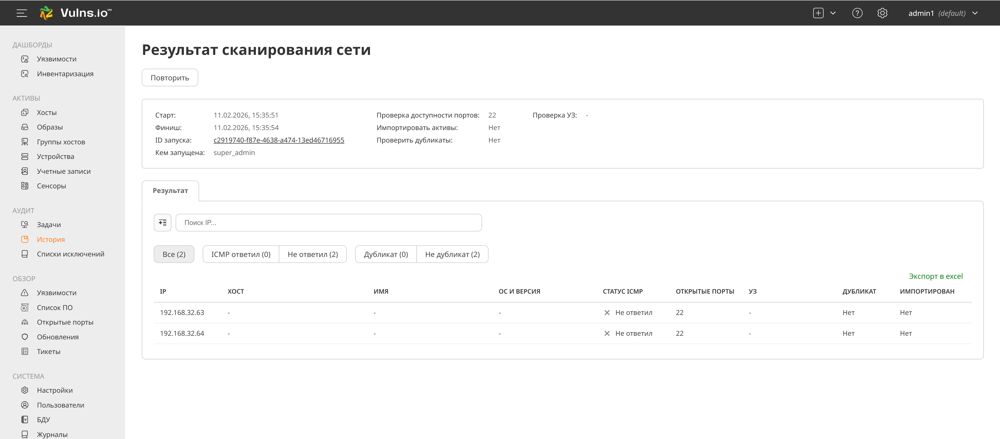

# Слепые зоны и их риски: почему важна инвентаризация сети

**"Слепые зоны"** — это устройства, сервисы или сегменты сети, которые не учтены в системах мониторинга, CMDB или Active Directory. Они возникают по разным причинам и создают серьёзные риски для безопасности и бизнес-процессов.

---

## Причины появления слепых зон

1. **Теневое IT** — устройства, подключённые без ведома ИТ-службы:
   - Тестовые серверы разработчиков.
   - Личные ноутбуки сотрудников.
   - IoT-устройства (IP-камеры, умные розетки, датчики).

2. **Новые устройства** — серверы, сетевое оборудование или виртуальные машины, добавленные в обход процессов ИТ-отдела.

3. **Изолированные сегменты** — DMZ, промышленные сети (OT), облачные инфраструктуры, которые не сканируются регулярно.

4. **Устаревшие записи** — устройства, давно выведенные из эксплуатации, но всё ещё числящиеся в документации.
---

## Опасности слепых зон

- ❌ **Необнаруженные уязвимости** — атакующие могут эксплуатировать незащищённые устройства.
- ❌ **Нарушение комплаенс** — невозможно подтвердить соответствие стандартам (ФСТЭК, PCI DSS, ISO 27001).
- ❌ **Риски для бизнеса** — сбои, утечки данных или атаки из-за неконтролируемых устройств.

---

## Решение: первичная инвентаризация сети

**Baseline** — это актуальная карта всех устройств, которая фиксирует:
- Все подключённые устройства (серверы, рабочие станции, сетевое оборудование).
- Их классификацию (по ролям, критичности, типам ОС).
- Открытые порты, сервисы, версии ПО.

**Преимущества baseline:**

- ✅ **Обнаружение новых устройств** — любое отклонение от эталонного состояния сигнализирует о потенциальной угрозе.
  
- ✅ **Приоритизация сканирования** — критически важные активы проверяются в первую очередь.
  
- ✅ **Контроль изменений** — отслеживание появления или исчезновения устройств.

---

### Классификация активов по критичности

| Группа               | Примеры                          | Приоритет сканирования | Частота проверки |
|----------------------|----------------------------------|------------------------|------------------|
| Критические серверы  | Базы данных, контроллеры домена | Высокий                | Ежедневно         |
| Сетевое оборудование | Маршрутизаторы, межсетевые экраны | Высокий                | Ежедневно         |
| Рабочие станции      | Ноутбуки, настольные ПК         | Средний                | Еженедельно       |
| IoT-устройства       | IP-камеры, датчики              | Низкий                 | Раз в месяц       |

---

### Как это работает в Vulns.io?

1. После **Discovery** система автоматически классифицирует активы по типу, ОС, роли в сети.

2. Администратор может вручную назначить критичность (например, пометить серверы БД как «Высокая важность»).

3. На основе классификации настраивается расписание и глубина сканирования.

---

## 2. Механика Discovery: методы и настройки

### Методы сканирования в Vulns.io

| Метод                          | Описание                                      | Когда использовать                     |
|--------------------------------|-----------------------------------------------|-----------------------------------------|
| ICMP (Ping Sweep)              | Проверка доступности хостов по ICMP-запросам. | Для быстрого обнаружения «живых» устройств. |
| TCP SYN Scan                   | Проверка открытых портов без полного соединения. | Для определения работающих сервисов. |
| Агентное сканирование          | Установка агента на устройство для сбора данных. | Для критически важных активов. |
| Безагентное сканирование       | Подключение по SSH/WinRM/SNMP для инвентаризации. | Для устройств, где нельзя установить агент. |
| Сканирование через Сенсоры     | Развёртывание модуля сканирования в изолированных сегментах. | Для закрытых сетей (за NAT, в облаке). |

---

### Настройка диапазонов и исключений

Чтобы не перегрузить сеть и не повредить чувствительное оборудование, важно правильно настроить параметры сканирования:

1. **Определение диапазонов IP:**
   - Сканировать только актуальные подсети (например, `192.168.1.0/24`).
   - Исключить чувствительные сегменты (например, промышленные сети с PLC).

2. **Исключения для хрупкого оборудования:**
   - Некоторые устройства (например, промышленные контроллеры) могут выйти из строя при активном сканировании.
   - Решение: добавить их в список исключений или сканировать только по ICMP.

3. **Ограничение скорости сканирования:**
   - Максимум 5–10 параллельных задач.
   - Скорость 100–500 пакетов/сек.
   - Тайм-аут 2–5 секунд.

---

## 3. Практический гайд: настройка первой задачи сканирования

### 3.1. Перейдите в раздел «Сканирование»
1. Откройте веб-интерфейс Vulns.io.
2. Перейдите в раздел **«Сканирование» → «Discovery»**.

### 3.2. Настройте параметры задачи

| Параметр               | Рекомендуемое значение         | Пояснение                                      |
|------------------------|--------------------------------|------------------------------------------------|
| Название задачи        | «Первое сканирование офисной сети» | Для удобства идентификации.                   |
| Диапазон IP            | `192.168.1.0/24`              | Укажите актуальную подсеть.                    |
| Методы сканирования    | ICMP + TCP SYN Scan           | Для обнаружения хостов и открытых портов.     |
| Скорость сканирования  | 100 пакетов/сек                | Оптимальная скорость для офисной сети.        |
| Параллельные задачи    | 5                              | Не перегружает сервер сканирования.           |
| Тайм-аут               | 3 секунды                      | Не ждать слишком долго неотвечающие хосты.    |
| Пропускная способность | 2 Мбит/с                       | Не мешает работе сети.                         |
| Время выполнения      | 01:00–04:00 (ночное время)    | Минимальная нагрузка на сеть.                 |

**Дополнительные настройки:**
- Исключения: добавьте IP-адреса устройств, которые не нужно сканировать (например, принтеры, промышленные контроллеры).
- Учётные данные: если планируете безагентное сканирование, укажите учётные записи для подключения по SSH/WinRM/SNMP.

---

## 4. Как Vulns.io определяет ОС, имена хостов и тип оборудования

### Определение ОС
- **По портам (примерно):**
  - `22 (SSH)` → Linux/Unix.
  - `3389 (RDP), 445 (SMB)` → Windows.
  - Точность ~70–80%, версия ОС не определяется.

- **Агентное сканирование (максимальная точность):**
  - Точное название и версия ОС (например, Ubuntu 22.04 LTS, Windows Server 2019).
  - Данные о ядре, архитектуре, обновлениях.

- **Безагентное сканирование (SSH/WinRM):**
  - Точная ОС и версия без установки агента.

### Определение имён хостов
- **Обратный DNS-запрос (PTR):**
  - Работает, если настроена PTR-запись (например, `server1.example.com`).
- **NetBIOS/WMI (для Windows):**
  - Получает имя хоста и домен.
- **Импорт из Active Directory:**
  - 100% точность имён хостов + дополнительная информация (домен, OU).

### Определение типа оборудования
- **По портам (примерно):**
  - `80, 443` → веб-сервер.
  - `139, 445` → файловый сервер (Windows).
  - Точность ~60–80%, модель оборудования не определяется.

- **SNMP (для сетевого оборудования):**
  - Модель (например, Cisco Catalyst 2960).
  - Серийный номер, версия прошивки, интерфейсы.

- **Агентное сканирование (максимальная точность):**
  - Модель сервера (например, Dell PowerEdge R740).
  - Конфигурация CPU, RAM, дисков.
    

---

## 5. Импорт активов в базу для анализа уязвимостей
1. Проверьте результаты в разделе **«Активы»**.
2. Исключите ложноположительные срабатывания (например, принтеры).
3. Сгруппируйте активы по критичности.
4. Настройте регулярное сканирование (ежедневно для серверов, еженедельно для рабочих станций).

---

## 6. Автоматизация: настройка расписания и контроль изменений

### Настройка регулярного сканирования
- Для критичных активов (серверы, сетевое оборудование):
  - Ежедневное сканирование на уязвимости.
  - Автоматическая генерация отчётов о новых уязвимостях.

- Для менее критичных активов (рабочие станции):
  - Еженедельное сканирование.

### Контроль изменений
- Используйте механизм сравнения в Vulns.io для отслеживания:
  - Новых устройств в сети.
  - Изменений в конфигурации (ОС, ПО, открытые порты).
  - Новых уязвимостей на известных активах.

---

## 7. Резюме

**1. Discovery** — это не разовое действие, а непрерывный процесс. Регулярное сканирование позволяет обнаруживать новые устройства и отслеживать изменения.

**3. На выходе получаем не просто список IP, а структурированную базу данных активов**:

  - Каждое устройство классифицировано по критичности.

  - Данные об активах обогащены информацией об ОС, ПО, открытых портах.

**5. Инвентаризация** — это первый шаг к полноценному управлению уязвимостями:

  - Без Discovery невозможно гарантировать полноту сканирования.

  - Без классификации невозможно приоритизировать защиту.

